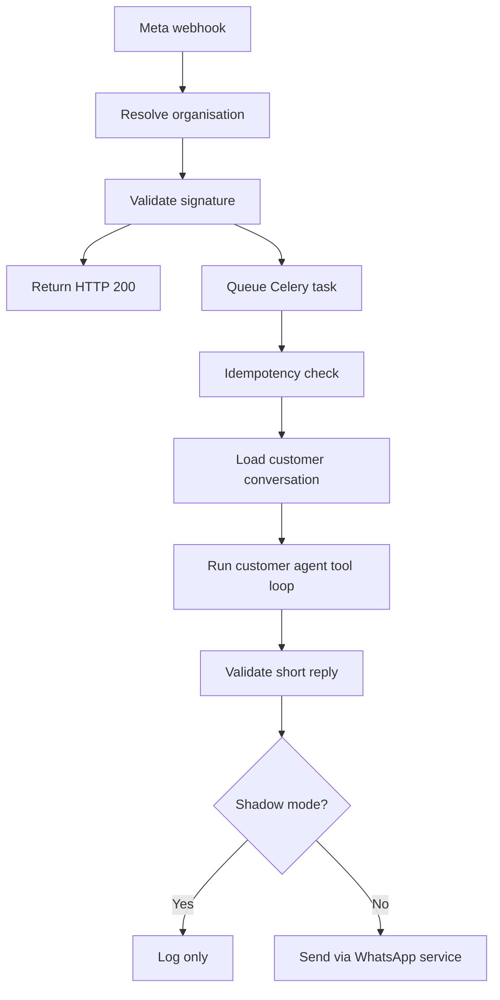

# WhatsApp Customer Sales Agent — Implementation Map

**Project:** Multi-tenant Ticketing SaaS  
**Stack:** Django/DRF, PostgreSQL, Redis/Celery, React/TypeScript/Vite, Meta WhatsApp Cloud API, OpenAI Responses API  
**Document status:** Source of truth — planning baseline  
**Version:** 1.0  
**Date:** 2026-08-11

## 1. Outcome

Build an independent, human-sounding WhatsApp customer sales assistant that helps customers discover excursions, checks live availability and pickup information, recommends a sensible multi-day itinerary, and prepares a secure server-side cart session.

The assistant does **not** create or confirm a booking. The customer opens the cart link, reviews and edits the itinerary, enters their personal information and email, chooses deposit or full payment, and submits the existing public checkout. Only the existing booking/payment system creates the booking.

## 2. Locked decisions

These decisions must not change accidentally during implementation:

1. The customer agent is independent from `ticketing/ai/seller/`.
2. Seller prompts, seller memory and seller workflows are not copied or reused.
3. Customer memory is isolated by organisation and WhatsApp customer identity.
4. The agent reads live organisation products; it never uses an invented/static catalogue as authority.
5. The agent never invents availability, prices, pickup times, inclusions, policies or discounts.
6. The agent does not create or confirm bookings.
7. The agent creates or updates a server-side itinerary/cart session and sends a secure link.
8. The customer reviews the cart and enters/approves personal information.
9. Existing public product links and the existing single-product checkout remain compatible.
10. Existing seller booking, seller discounts and commissions remain untouched.
11. Discounts are controlled by owner-configured backend rules. The model cannot choose a percentage.
12. OpenAI credentials continue through `OrganisationAIService`; credentials are never exposed to the frontend.
13. The webhook returns quickly and queues AI processing through Celery.
14. The feature is disabled by default and introduced through tests, staging and shadow mode.
15. Age-restricted products must obey configured age requirements at recommendation and checkout. The assistant must not encourage access by underage customers.
16. Every implementation phase includes backend tests and frontend tests where applicable. Testing is continuous, not postponed until the end.

## 3. Customer experience

### Example journey

1. Customer writes: “I want to visit Saona.”
2. Agent asks for the desired date, group size and hotel when relevant.
3. Backend checks product status, live availability and pickup schedules.
4. If unavailable, agent suggests a real available alternative.
5. Agent asks about the rest of the holiday and interests.
6. Agent proposes a balanced itinerary, leaving reasonable time between activities.
7. Backend evaluates active promotion rules.
8. Agent mentions only the promotions returned by the backend.
9. Customer accepts or changes the itinerary.
10. Agent creates a server-side cart session.
11. Agent sends one short secure checkout link.
12. Customer reviews items/dates/quantities, provides name/WhatsApp/email/hotel, and selects deposit or full payment.
13. Backend revalidates all items and calculates authoritative prices.
14. Existing public checkout creates the booking and begins Stripe/PayPal payment when selected.
15. Existing notification flow sends confirmation/PDF after the appropriate payment event.

## 4. System boundary

### The agent may

- Detect and reply in the customer's language.
- Ask one useful question at a time.
- Search active public products for the resolved organisation.
- Read descriptions, inclusions, exclusions, FAQs, duration and policies.
- Check local and external availability.
- Resolve hotel pickup locations, days, times and instructions.
- Recommend alternatives and complementary excursions.
- Assemble and revise a multi-day itinerary.
- Ask for dates, hotel, group size and preferences.
- Evaluate backend promotion results.
- Create/update/expire an itinerary cart session.
- Send the secure cart-session link.
- Hand off to a human.

### The agent may not

- Create, confirm, cancel, refund or mark a booking paid.
- Collect or store card details.
- Set authoritative prices or totals.
- Invent or override discounts.
- Select an unavailable date.
- Override pickup schedules.
- Choose between ambiguous suppliers.
- Change seller commission rules.
- Claim to be a named human employee.
- expose one organisation's data to another.

## 5. Existing system to preserve

| Existing component | Current responsibility | Decision |
| --- | --- | --- |
| `ticketing/ai/seller/` | Seller booking assistant | Do not change or reuse |
| `TicketingWhatsAppSettings` | Per-organisation Meta credentials and webhook state | Reuse |
| `whatsapp_webhook_views.py` | Tenant resolution, signature validation, fast acknowledgement | Extend additively |
| `BookingWhatsAppService` | Outbound Meta text/template/media messages | Reuse |
| `ticketing/tasks.py` | Celery notification tasks and retry conventions | Add separate task |
| `OrganisationAIService` | Secure organisation AI settings/provider construction | Reuse and extend feature check |
| `OpenAIProvider.generate_text()` | Existing one-shot AI generation | Preserve unchanged |
| `ExperienceProduct` and related models | Product catalogue and operational rules | Read as authority |
| `get_live_product_availability()` | Local/Wellet live availability | Reuse |
| Pickup models/services | Pickup location and schedule resolution | Reuse |
| `BookingSerializer` | Booking creation/items/financial processing | Keep as final booking authority |
| `PublicBookingViewSet` | Existing public booking creation | Preserve |
| Existing Stripe/PayPal views | Payment session/order flows | Preserve |
| `PublicProductDetailPage` | Existing single-product selection | Preserve |
| `PublicCheckoutPage` | Existing single-product checkout | Extend with optional cart-session mode |

## 6. Proposed backend structure

```text
ticketing/
├── ai/
│   ├── customer/
│   │   ├── __init__.py
│   │   ├── agent.py
│   │   ├── prompts.py
│   │   ├── schemas.py
│   │   ├── tool_registry.py
│   │   ├── tool_executor.py
│   │   ├── conversation_service.py
│   │   ├── product_tools.py
│   │   ├── availability_tools.py
│   │   ├── pickup_tools.py
│   │   ├── itinerary_tools.py
│   │   ├── promotion_tools.py
│   │   ├── cart_tools.py
│   │   └── handoff_service.py
│   └── translation_service.py
├── customer_ai_models.py            # optional split; otherwise models.py
├── customer_cart_service.py
├── customer_ai_tasks.py              # or carefully added to tasks.py
├── customer_ai_serializers.py
├── customer_ai_views.py
├── whatsapp_webhook_views.py
└── urls.py

organisations/
└── ai/
    ├── constants.py                  # FEATURE_WHATSAPP already exists
    ├── service.py                    # check WhatsApp-specific enable switch
    └── providers.py                  # add tool-capable API without changing generate_text
```

Splitting new customer code into focused modules is preferred over expanding the already-large `models.py`, `views.py`, `serializers.py` and `tasks.py`. Model imports may be re-exported if Django app-loading requires it.

## 7. Proposed frontend structure

```text
frontend/src/modules/ticketing/
├── api/
│   └── ticketingApi.ts               # add cart-session API methods
├── components/cart/
│   ├── ItineraryCart.tsx
│   ├── ItineraryCartItem.tsx
│   ├── ItineraryTimeline.tsx
│   ├── CartPriceSummary.tsx
│   └── CartValidationNotice.tsx
├── pages/
│   └── PublicCheckoutPage.tsx        # optional cart_session branch
├── types/
│   └── ticketingTypes.ts             # cart/session/promotion types
└── i18n/translations/
    └── checkout.ts                   # itinerary/cart strings
```

No new public route is required initially. Existing checkout routes accept an optional query parameter:

```text
/checkout?cart_session=<opaque-random-token>
```

## 8. New data model

### `TicketingCustomerAISettings`

Organisation-scoped sales-agent configuration:

- `organisation` — one-to-one
- `is_enabled` — default false
- `shadow_mode` — default true
- `agent_display_name`
- `company_description`
- `selling_points`
- `sales_instructions`
- `welcome_message`
- `tone`
- `max_reply_characters`
- `supported_languages`
- `human_handoff_enabled`
- `human_handoff_whatsapp`
- `public_checkout_base_url`
- `cart_session_ttl_minutes`
- `allow_itinerary_recommendations`
- `allow_cart_session_creation`
- timestamps

### `CustomerAIConversation`

- `organisation`
- `channel` (`whatsapp` initially)
- `external_customer_id` (normalized WhatsApp number)
- `customer` nullable link to existing `Customer`
- `status` (`active`, `handoff_requested`, `human_owned`, `closed`)
- `language`
- `openai_conversation_id`/`last_response_id` when used
- structured preference state: travel dates, hotel, adults, children, infants, interests
- `active_cart_session` nullable
- last inbound/outbound timestamps
- timestamps
- unique active-conversation protection per organisation/channel/customer

### `CustomerAIMessage`

- `conversation`
- `direction` (`inbound`, `outbound`)
- `role` (`customer`, `assistant`, `tool`, `system`)
- Meta message ID
- message type
- text
- tool name and sanitized tool payload/result
- delivery/status metadata
- idempotency key
- timestamps

### `CustomerCartSession`

- `organisation`
- cryptographically random public token/UUID
- `conversation` nullable
- customer WhatsApp number
- status (`draft`, `ready`, `converted`, `expired`, `abandoned`)
- language
- currency
- subtotal, validated discount and total snapshots for display
- selected promotion nullable
- expiration timestamp
- converted booking nullable
- version number for optimistic updates
- timestamps

The token identifies the session; prices and personal information are not placed in the URL.

### `CustomerCartItem`

- `cart_session`
- `product`
- `service_date`
- adult/child/infant quantities
- package/ticket/external option identifiers
- pickup location and resolved pickup schedule
- selected supplier/agreement only when unambiguous and backend-resolved
- backend price snapshot for display
- validation status/error
- sort order
- timestamps

Every cart open/update/final submission revalidates current operational data.

### `CustomerCartPromotionRule`

- `organisation`
- name/code
- active date window
- rule type (`minimum_distinct_products`, `specific_product_bundle`, `minimum_cart_amount`)
- required products
- minimum distinct items
- benefit type (`percentage`, `fixed_amount`)
- benefit value
- maximum discount amount
- combinable flag (default false)
- priority
- active flag
- timestamps

The backend returns the best eligible rule according to deterministic priority. OpenAI only explains the result.

## 9. API map

### Internal agent services

These are Python service/tool calls, not public endpoints:

- `search_products(organisation, query, preferences)`
- `get_product_details(organisation, product_id, language)`
- `check_product_availability(organisation, product_id, date, quantities, option_id)`
- `find_alternative_dates(...)`
- `find_alternative_products(...)`
- `search_pickup_locations(organisation, hotel_query)`
- `resolve_pickup_schedule(organisation, product_id, location_id, date)`
- `evaluate_cart_promotions(cart_session)`
- `create_or_update_cart_session(...)`
- `build_checkout_url(cart_session)`
- `request_human_handoff(conversation, reason)`

### New public endpoints

```text
GET   /api/ticketing/public/<organisation_slug>/cart-sessions/<token>/
PATCH /api/ticketing/public/<organisation_slug>/cart-sessions/<token>/
POST  /api/ticketing/public/<organisation_slug>/cart-sessions/<token>/validate/
POST  /api/ticketing/public/<organisation_slug>/cart-sessions/<token>/checkout/
```

Rules:

- Resolve tenant from the path/domain, never from a client-supplied organisation ID.
- Use token + organisation together.
- Do not expose internal OpenAI/tool/message records.
- Rate-limit public session reads and writes.
- Reject expired/converted sessions.
- Revalidate before returning totals and before booking creation.
- Use a transaction and idempotency key when converting to a booking.

## 10. WhatsApp processing flow



Delivery/status webhook events update message records but do not invoke the sales model.

## 11. OpenAI integration

Preserve `BaseAIProvider.generate_text()` and `OpenAIProvider.generate_text()` for translations and existing features.

Add a separate tool-capable interface, for example:

- `run_tool_turn(...)`
- strict JSON schemas for every function tool
- bounded tool loop (for example, maximum 6 tool calls per inbound message)
- timeout and retry handling
- conversation/response state storage
- sanitized tool logging
- final text length enforcement

The model proposes tool calls; Django executes all reads/writes and returns structured results. The model never directly accesses the database.

## 12. Prompt contract

The customer prompt must require:

- Natural, warm sales tone without pretending to be a named human.
- Usually one to three short sentences.
- One useful question at a time.
- Match the customer's language.
- Never invent operational information.
- Use tools before stating price, date, availability or pickup.
- Avoid repeating information already supplied.
- Recommend a manageable itinerary instead of overcrowding days.
- Ask permission before adding recommendations to the cart.
- Mention promotions only from promotion-tool output.
- Clearly say the customer must review and complete checkout.
- Escalate uncertainty, complaints, payment problems and human requests.
- Respect configured product age restrictions.

## 13. Existing-code changes

| File | Change | Risk control |
| --- | --- | --- |
| `organisations/models.py` | Add `whatsapp_enabled` to AI settings | Additive, default false |
| `organisations/ai/service.py` | Enforce `FEATURE_WHATSAPP` switch | Existing translation branch unchanged |
| `organisations/ai/providers.py` | Add separate tool method/result types | Preserve `generate_text()` signature/behavior |
| `ticketing/models.py` or split module | Register new customer/cart models | Additive migration only |
| `ticketing/whatsapp_webhook_views.py` | Queue valid inbound messages | Existing verification/signature/200 behavior retained |
| `ticketing/tasks.py` or split task module | Add independent inbound task | Existing notification tasks unchanged |
| `ticketing/urls.py` | Add public cart-session routes | Existing routes unchanged |
| `ticketing/serializers.py` | Eventually harden public local pricing | Only after characterization tests |
| `ticketingApi.ts` | Add cart-session methods | Existing methods unchanged |
| `PublicCheckoutPage.tsx` | Add optional multi-item cart mode | Existing query-param mode preserved |
| Ticketing types/i18n | Add cart types and labels | Additive |

## 14. Pricing security finding

The current single-product frontend sends price-like query parameters and includes `unit_price` in `items_payload`. The backend correctly replaces the price for validated Wellet/Coco Bongo options, but the local-product branch may accept a submitted `unit_price`.

Do not change this behavior blindly. First add characterization tests for:

- Local adult/child/infant pricing
- Availability price overrides
- Packages
- Event ticket types
- Transfers and price bands
- Wellet/Coco Bongo live options
- Seller signed offers
- Deposits, taxes and discounts

Then refactor backend price resolution into one authoritative service and make both existing checkout and cart checkout use it. Browser values become display hints only.

## 15. Test map

### Continuous test rule

Every vertical feature is delivered with both sides tested:

```text
Backend model/service/API tests
        +
Frontend component/page/API-client tests
        +
End-to-end customer-flow test
        =
Eligible to proceed
```

For backend-only infrastructure, frontend regression tests must still confirm that existing public pages remain unaffected. For frontend-only presentation changes, backend contract tests must confirm that the API shape and validation remain authoritative.

### Tenant and security tests

- Webhook resolves the correct organisation by WABA/phone ID.
- Mismatched organisation/token cannot read a cart.
- Invalid Meta signature is rejected.
- Duplicate Meta message is processed once.
- Encrypted provider key never appears in API/log output.
- Model cannot invoke an unknown tool.
- Expired and converted cart sessions cannot be reused.
- Final checkout ignores tampered prices/discounts.

### Product and itinerary tests

- Only active, public, same-organisation products are returned.
- Unavailable dates are rejected.
- Alternatives contain only real availability.
- Item-specific service dates survive into booking items.
- Pickup-required products cannot proceed without a valid schedule.
- Multi-day ordering is stable.
- Age restrictions are respected.

### Promotion tests

- Ineligible carts get no discount.
- Minimum distinct-product rules work.
- Specific bundles work.
- Fixed/percentage caps work.
- Expired/disabled rules are ignored.
- Non-combinable rules do not stack.
- OpenAI cannot override the selected rule or amount.

### Regression tests

- Existing product-detail checkout still works.
- Existing seller offer links still work.
- Existing seller commission values remain unchanged.
- Existing Stripe and PayPal flows still work.
- Existing booking confirmation/PDF notifications still work.
- Wellet validation still uses live backend prices.

### Frontend automated tests

- Existing single-product checkout renders and submits normally.
- `cart_session` mode loads a valid multi-item itinerary.
- Loading, expired, invalid and already-converted sessions show safe states.
- Customer can edit permitted dates, quantities, options and pickup selections.
- Customer cannot edit server-authoritative prices or discounts.
- Deposit/full-payment choices reflect backend-provided options.
- Required name, WhatsApp, email and pickup validations work.
- Multi-day itinerary ordering and summaries are correct.
- API errors do not lose customer-entered form information.
- Mobile WhatsApp-to-checkout experience remains usable.
- Existing seller links and custom-domain checkout routes remain compatible.

### End-to-end tests

- Simulated WhatsApp inbound message produces a shadow-mode reply record.
- Product discovery → availability → itinerary → cart link works.
- Unavailable requested date → valid alternative → cart works.
- Two eligible products → backend promotion → correct cart display works.
- Cart review → customer details → deposit/full selection → booking creation works.
- Stripe/PayPal handoff uses the authoritative booking amount.
- Confirmation and notification behavior remains unchanged.
- Duplicate webhook or repeated checkout submission does not duplicate bookings.

## 16. Rollout plan

### Phase 0 — Baseline and branch

- Create a dedicated Git branch.
- Record current passing tests/build status.
- Add characterization tests around public checkout/pricing.
- Add frontend regression tests for product detail and public checkout.
- No production behavior change.

### Phase 1 — Additive data layer

- Add customer AI settings, conversation/message, cart/item and promotion models.
- Run additive migration.
- Add backend model/migration tests and frontend regression tests.
- Feature remains disabled.

### Phase 2 — Cart services and APIs

- Implement validation, promotion evaluation and secure public session endpoints.
- No WhatsApp/OpenAI connection yet.
- Add backend service/API/security tests.
- Add frontend API-client contract tests before UI integration.

### Phase 3 — Optional frontend cart mode

- Add `cart_session` branch to existing checkout.
- Preserve single-product checkout.
- Add frontend component/page tests and backend checkout-contract tests.
- Test multi-item review/edit/customer-details/payment choice end to end.

### Phase 4 — Customer agent tools

- Implement independent customer agent and tool loop.
- Unit-test every tool without Meta.
- Add frontend regression tests to confirm customer checkout remains stable.

### Phase 5 — WhatsApp shadow mode

- Queue inbound messages.
- Generate and log proposed replies.
- Do not send automatically.
- Review accuracy, tone, latency and tool decisions.
- Run backend webhook/task integration tests and end-to-end shadow-flow tests.

### Phase 6 — Controlled pilot

- Enable for Punta Cana Discovery only.
- Keep immediate organisation-level disable switch.
- Monitor errors, handoffs, abandoned carts and conversions.
- Run the full backend, frontend and end-to-end regression suite before enabling.

### Phase 7 — Wider multi-tenant enablement

- Enable only after per-tenant configuration and acceptance tests.

## 17. Deployment and rollback gates

Every phase must satisfy:

- Database backup before production migration.
- Migration tested on a copy/staging database.
- Backend test suite passes.
- Frontend unit/component test suite passes.
- Frontend typecheck/build passes.
- Relevant end-to-end tests pass.
- Existing public checkout smoke test passes.
- Feature remains off until explicitly enabled.
- Each phase is a separate commit/release checkpoint.

Rollback principles:

- Disable the WhatsApp feature first.
- Revert application code to the previous checkpoint.
- Keep additive tables in place during immediate rollback; do not drop production data under pressure.
- Restore database only for a confirmed migration/data incident.

## 18. Change ledger

Update this table before implementing scope changes.

| Date | Decision/change | Status | Notes |
| --- | --- | --- | --- |
| 2026-08-11 | Independent customer agent; no seller-agent mirroring | Locked | Customer memory and prompts isolated |
| 2026-08-11 | Agent does not create/confirm booking | Locked | Creates itinerary/cart session only |
| 2026-08-11 | Customer reviews and enters personal information | Locked | Existing checkout owns final submission |
| 2026-08-11 | Server-side cart session; no price/customer data in URL | Locked | Secure opaque token only |
| 2026-08-11 | Multi-excursion itinerary recommendations | Locked | Live availability/pickup required |
| 2026-08-11 | Owner-controlled bundle promotions | Locked | AI never invents discount |
| 2026-08-11 | Preserve existing single-product and seller checkout flows | Locked | Optional cart-session branch |
| 2026-08-11 | Additive, feature-flagged, shadow-mode rollout | Locked | Protect production stability |
| 2026-08-11 | Backend and frontend tests throughout every phase | Locked | No test deferral until the end |

## 19. Definition of done

The feature is complete only when:

- A WhatsApp customer receives short, natural, accurate replies.
- All factual selling information comes from organisation-scoped backend tools.
- The agent can create and revise a real multi-day itinerary.
- The agent can prepare a valid multi-product cart session.
- Customer opens one secure link and sees correct dates/options/quantities/pickup/totals.
- Customer can edit, provide email/contact details, choose deposit/full payment and submit.
- Existing booking/payment/notification flows remain authoritative.
- Cross-tenant, tampering, idempotency, expiry and regression tests pass.
- Backend, frontend and end-to-end automated tests pass.
- Feature can be disabled immediately without disabling normal WhatsApp confirmations or public checkout.

## 20. Next implementation task

Create the Phase 0 characterization-test matrix and inspect the existing project test structure. No production behavior should be modified until those baseline tests exist and pass.
